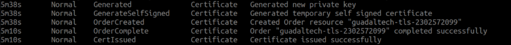
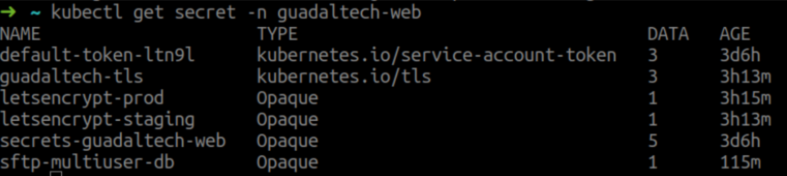

# [](#header-1)Deploy Cert-Manager in Kubernetes.

### For have  to deploy of Cert-Manager (successor of kube-lego) we have that to follow the next steps for that your installation is correct.

 - To get started we to apply the certificates of kubernetes:
 ```
kubectl apply -f
https://raw.githubusercontent.com/jetstack/cert-manager/release-0.7/deploy/m
anifests/00-crds.yaml
 ```

 - We create the namespace that your name will is cert-manager and also
this namespace will have the label of validation in true:
```
kubectl create namespace cert-manager
kubectl label namespace cert-manager
certmanager.k8s.io/​ disable​ -validation=​ "true"
```

 - When you have finished with the namespace creation, we have to add the repository and update so that you can do the installation of cert-manager:
```
helm repo add jetstack https://charts.jetstack.io
helm repo update
```

 - Next we install the certificate manager but indicating the installation without the RBAC privileges as it is in our case, we will not use this type of authentication with the cluster (but in case we do use it, the RBAC value will not be indicated in false and thus install):
 ```
helm install --name cert-manager --namespace cert-manager --​ set
rbac.create=​ false​ jetstack/cert-manager
 ```

 - After we have that to check that the pods is ready for so we can
to generate the certificate and that so the pages is in https
correctly:
```
➜ ~ kubectl get pod -n cert-manager
NAME                                        READY      STATUS    RESTARTS   AGE
cert-manager-6f68b58796-xxgbc               1/1        Running   0          1m
cert-manager-cainjector-67b4696847-2pqm9    1/1        Running   0          1m
cert-manager-webhook-6f58884b96-7lfcj       1/1        Running   0          1m
```

 - When already are the pods deploy correctly. We download the
next file and we deploy in the namespace in the that want add the
certificate SSL (it depends of if is production or development, we download the file one or the file two and once to edited, we deploy with the next command).
  1. File on (Deploy for production).
```
wget
https://raw.githubusercontent.com/jetstack/cert-manager/release-0.7/docs/tut
orials/acme/quick-start/example/production-issuer.yaml
```
```
nano​ ​ production-issuer.yaml

   apiVersion: certmanager.k8s.io/v1alpha1
   kind: Issuer
   metadata:
     name: letsencrypt-prod
   spec:
     acme:
       # The ACME server URL
       server: https://acme-v02.api.letsencrypt.org/directory
       # Email address used for ACME registration
       email: juanjose.lopez@guadaltech.es
       # Name of a secret used to store the ACME account private key
       privateKeySecretRef:
         name: letsencrypt-prod
       # Enable the HTTP-01 challenge provider
       http01: {}

```
```
kubectl create -f production-issuer.yaml -n "namespace-desired"
```

  2. File two (Deploy for development).
```
wget https://raw.githubusercontent.com/jetstack/cert-manager/release-0.7/docs/tutorials/acme/quick-start/example/staging-issuer.yaml
```
```
nano staging-issuer.yaml

   apiVersion: certmanager.k8s.io/v1alpha1
   kind: Issuer
   metadata:
     name: letsencrypt-staging
   spec:
     acme:
       # The ACME server URL
       server: https://acme-staging-v02.api.letsencrypt.org/directory
       # Email address used for ACME registration
       email: soporte@guadaltech.es
       # Name of a secret used to store the ACME account private key
       privateKeySecretRef:
         name: letsencrypt-staging
       # Enable the HTTP-01 challenge provider
       http01: {}
```
```
kubectl create -f staging-issuer.yaml -n "namespace-desired"
```

 - Next have that to modify the ingress of service that will have the SSL, indicating the next lines (The next lines are of example).
 ```
 "annotations": {
      "certmanager.k8s.io/acme-challenge-type": "http01",
      "certmanager.k8s.io/issuer": "letsencrypt-prod",
      "kubernetes.io/ingress.class": "nginx",
      "kubernetes.io/tls-acme": "true"
    }
 ```

 - When already beech finish to deploy the issuer and to edited the ingress, We see the events of deployment or replication-controller of page and  we check that the pod of cert-manager already to verified the page and for that already have of certificate:

 

 - For to check correctly that it generated the SSL. We have to check the secret that were generated with the command of kubectl:




__If we do not have to deploy the nginx-ingress, the following command allow us to deploy the basic nginx-ingress being compatible with the  cert-manager.__

```
helm install --name ingress-nginx --namespace ingress-nginx stable/nginx-ingress
```


